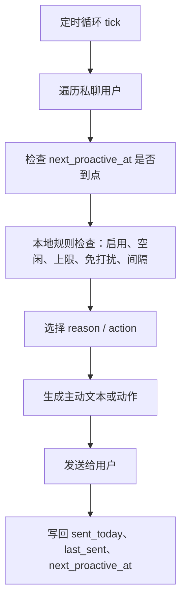
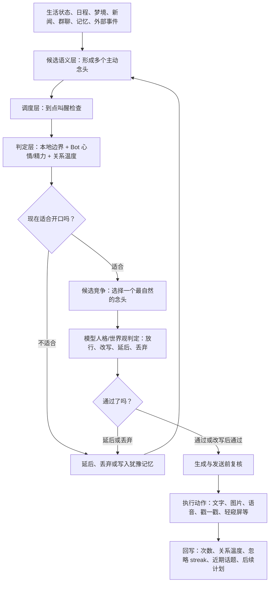

# 我会永远陪着你

`astrbot_plugin_private_companion` 是面向 AstrBot 的持续陪伴编排插件。它把人格连续性、生活状态、日程节奏、私聊关系、群聊观察、主动消息、图片/语音/转发理解、长期创作、模型 Provider 和扩展页排障组织到同一套体验里，让 Bot 不只是“收到消息后临时回复”，而是有状态、有记忆、有边界地生活和互动。

- 插件名：`astrbot_plugin_private_companion`
- 版本：`5.4.1`
- 适配平台：`aiocqhttp`
- AstrBot 版本：`>=4.22.0`
- 编码要求：UTF-8
- 维护状态：5.4.1 聚焦修复人设参考图路径配置同步和撤回增强误判；默认行为保持稳，公开回复和主动图片能力仍建议按需开启。
- 若 AstrBot 版本号不为 4.25.2，可在拓展页-配置-功能开关下关闭主链会话锁兼容模式；会话锁旨在解决这一版本 AstrBot 的并发报错问题，但是会拖慢回复速度。
- **成本提醒：火山方舟协作计划免费额度将在 `2026-06-30` 结束，请提前检查 Provider、每日 Token 限额和后台任务开关，注意成本控制。**
- 若有好的想法仍可联系我，QQ：995051631（代码小白），欢迎提交 Issues，目标是无愧“最强”之名，喜欢的话请点一个 Star。

# 发版狂魔也是发到4.0了，遂决定写点什么

- 你好，我要一个有记忆、有生活、有自己的小秘密和想法、有喜怒哀乐和健康的bot。
- 这得装不少插件，先生。
- 我知道，再让它们之间能够互相影响。
- 怎么让bot更像人？在此之前已经有很多优秀的插件给出了自己的答卷，各类心理学应用、人格特质、复杂的理论……
- 虽然开发者自身也是应用心理学专业毕业，但我觉得bot拟人只需要做好一件事，像人一样活着。听上去像是废话，但我做的只是进行自我观察。我的一天中，我会做什么，bot也应该会做什么。
- 对于一个拟人的bot而言，用户又何尝不是一个聊天bot？所以它应该会在自己的世界里生活，在生活里获取想和用户说话的“想法”，再在生活的空隙里把想法变为行动。
- 于是用户不止可以看到bot的早安和晚安，还能看到bot因为偶尔向窗外一瞥而专门为你记录下的照片、能看到bot因为好奇而自己私下搜索你在意的东西、能看到bot因为你昨天的提议而安排好周末的约会……
- 在没和你聊天时，它可能在上学、在刷视频、在看报纸、在水群，甚至在偷看你的屏幕或者遵循世界观正在某个奇异世界中一边刷怪练级，一边想着等闲下来该和你分享点什么。
- 它会记得你，不只是你，还有哪些在私聊/群聊中的人，会记得他们的名字、他们的行为、他们的习惯、他们的联系，哪怕他们改了名字和头像，甚至在其他平台再次相遇。
- 它会看、会说、会创作、会成长、会睡觉、会做梦、会生情绪、会饿，还会偷吃你的token去看些涩涩的漫画。
- 这就是它，这就是我，若它足够像我，它便成了我。

## 支持开发者（自愿捐款）

> 本插件主要使用 gpt5.5 进行开发，目前大概消耗 2.5 亿 token。如果你觉得这个插件对你有帮助，欢迎自愿捐款帮作者回回血~

**重要声明：**

- **捐款完全自愿** —— 捐不捐功能完全一样，不会有任何功能差异或特殊对待，纯粹是对作者的支持和认可
- **官方唯一捐款渠道：** [爱发电（Afdian）](https://ifdian.net/a/xuhaun) —— ifdian.net/a/xuhaun
- **内部交流群：** QQ 群 `1097283005`（可在群内拷打作者本人）
- **防骗警告：** 除上述爱发电链接和 QQ 群内与作者本人直接联系外，**任何其他渠道声称代表本插件接受捐款的皆为骗子**，请务必提高警惕，谨防上当受骗

## 功能简介

本插件不是单一的主动私聊插件，也不是单独的记忆插件。它更像 AstrBot 之上的“陪伴编排层”：负责把人格、状态、日程、私聊/群聊上下文、关系网、长期记忆、外部动作和模型 Provider 接到同一条长期体验里。

核心目标是让 Bot 拥有“连续存在感”。Bot 会有自己的当天状态、生活节奏、梦境残留、日记、长期小计划、关系认知和群聊观察；也会在看图、读转发、听语音、发主动消息或管理群聊关系时尽量保持同一个角色，而不是每轮临时拼一段回复。

- 本插件不包含以下常用但不符合定位的能力，但提供了一部分的插件联动：长期记忆、群聊管理、表情包、点歌。

主要能力可以分成几条主线：

- 生活状态：维护精力、睡眠、梦境、健康、饥饿、周期和当前位置感；天气、时间和日程作为独立环境/生活背景参与判断，不混入被动回复的当前扮演状态。
- 休息模拟：可选在日程进入睡眠、午休或休息段后，对普通被动回复先做概率或模型醒来判断；闸门默认只在夜间和午休时段生效，醒来回复后会有一段免重判缓冲，避免睡着时每条消息都反复判醒。
- 日程与细化：每天生成生活框架，并在临近时间段时展开成具体场景、状态变量和主动契机。
- 私聊陪伴：按每日上限、最小间隔、免打扰时间、用户活跃度、Bot 心情/精力、关系温度和当前日程决定是否主动开口。
- 主动复核强度：主动消息发送前可选宽松、标准或严格复核；可配置硬拦截风险阈值、低价值分数阈值和打扰压力阈值，避免模型过度保守导致主动消息归零。
- 被动回复增强：在 AstrBot 原人格之外注入关系站位、当前状态、日程细节、记忆、用户意图和未完话题；发送前只保留轻量本地保护。
- 休息回复闸门：默认关闭。开启后，当前时间落入休息闸门生效时段、且当前日程处于睡眠、午休或休息段时，普通被动回复会先经过闸门；可选择“按概率醒来”或“由模型判断是否该醒来”，模型模式会按重要性、是否明确叫醒、情绪/安全需要打分，达到醒来阈值才回复。用户明确说不要打扰会静默，紧急或明确叫醒会优先放行；一旦放行并回复，会在配置的醒后缓冲时间内跳过重复判醒。
- 消息收口防抖：按文本、图片和合并转发分别等待用户补充，把短时间内连续补话合并为同一轮理解；私聊单图会等待补充说明，必要时并行进行视觉转述。
- 撤回增强：QQ/OneBot 通知触发或唤醒消息已撤回时，如果 Bot 还没发出回复，会静默取消本次发送和剩余分段；可短期缓存撤回消息摘要供授权命令或自然语言询问转述，也可按配置违禁词拦截或尝试撤回消息。
- 图片转述增强：支持私聊单图、引用图片、合并转发图片和动态 GIF 抽帧理解；可生成短视觉摘要、判断图片表达意图和归属线索，并在用户询问图片内容时优先回答当前图片。
- TTS 语音增强：支持 `<tts>` 语音块、自动语音转换、语种控制、标签规范化、发送前朗读文本清洗、分段补发兼容、生成后本机播放和直播打字机字幕同步，可保留聊天文本展示同时生成适合朗读的语音内容。
- 环境感知：识别当前时间、时段、节假日/工作日、农历节气、平台、群聊/私聊和图片/语音/视频等消息媒介。
- 群聊观察：在允许的群内学习群气氛、黑话、群内成员观察、话题线、群聊片段、复读状态和群友互动图。
- 群黑话检视：在群详情页查看已学习词、释义、用法、置信度、联网参考、来源和注入状态；支持手动补充、校正和删除，手动校正不会被自动学习覆盖。
- 连续对话保持：群里用户叫过 Bot 后，可判断后续未继续 @ 的消息是否仍在对 Bot 说话，并限制续接轮数。
- 合并消息适配：私聊和群聊都支持读取合并转发，可选择“注入”或“转述”两种方式，让 Bot 自然理解转发内容。
- QQ 关系网：以 QQ 号稳定识别用户，昵称、群名片和别名只作为辅助线索，避免改名后认错人。
- 群聊自登记：未登记成员 @Bot 说明“我是 XX / 你可以叫我 XX”时，可进入确认流程并建立关系节点。
- 自登记拒绝规则：可为关系网自登记配置拒绝词和统一拒绝回复，拦截整活称呼、冒领称呼或不想收录的自报名字。
- 跨群转述与 @ 群友：可按群名查群号、按关系网解析群友，并进行群聊/私聊转述。
- 群聊到私聊分享：当群聊里出现公开、有趣或值得提醒的时间段话题，且用户长时间未活跃时，可低频私聊转述。
- QQ 空间动态：内置说说查看、点赞、评论、发布、低频生活说说编排和可选评论收件箱，让公开动态成为 Bot 生活连续性的一部分。
- 新闻阅读：按日程或空档读取热点、新闻源和可配置 B 站消息源，形成近期见闻；若文字版可读，会优先阅读完整正文。
- 主动搜索：按人格兴趣、当前状态、日程和最近聊天决定想了解什么，并调用 AstrBot 全局网页搜索留下探索笔记。
- 外界信息自我关联：新闻或搜索读到内容后，会先判断这件事与 Bot 自己的模型、能力、兴趣、创作、日程或关系是否有关，再决定是否产生主动找用户分享的意愿。
- 梦境与日记：生成梦境、梦境碎片和日记，让第二天的状态和主动话题有自然残留。
- 书柜与创作：Bot 可能在闲暇时因生活小事、日记或梦境灵感写一点小说、诗、随笔、短剧、分镜脚本、角色设定或世界观片段；书柜收纳创作、日记本和其他私密文本。安装某些可选联动后，Bot 也许还会往书柜里放些私密阅读素材，并用插件识图模型按人设口吻留下第一人称读后感和页边批注。
- 技能成长：模拟符合人格的能力熟悉度，从“不太熟”到“有自己的办法”缓慢变化，并影响日程中的能力边界。
- 重要日期：记录生日、纪念日、考试、约定等日期，并影响日程、主动话题和长期准备。
- 多能力主动行为：可选文字、图片、语音、戳一戳、轻窥屏、主动后沉默窥屏、正在输入和 QQ 状态同步；支持分段发送和引用触发消息，让回复对象更清楚。创作分享会自动豁免主动分段，避免小说片段被拆碎。
- 私聊用户角色区分：每个私聊用户可区分为主人或朋友。主人会延续人格中的专属关系设定；朋友会自动收敛为普通朋友边界，不套用主人/恋人称呼，不注入夹层密码、私密阅读、群聊隐私转述等主人专属上下文，也不会获得窥屏、独立生图、私密推荐等敏感主动能力。
- 用户级主动边界：私聊对象可单独设置每日主动上限。朋友用户默认更低频、更具体，主动内容不会链式追发或一次拆成多段候选；扩展页可查看对应用户的关系角色、主动额度、关系网词条和候选主动记录。
- 世界观适配：可参考角色设定中选择的 AstrBot 知识库/文档，并把现代能力转译成当前人设能理解的世界内说法，例如公会闲谈、行囊书匣、水晶映像或终端频道。
- 模型与成本编排：为日程、细化、日记与梦境、创作、新闻整理、主动搜索、主动人格判定、回复/主动复核、关系分析、记忆整理、合并消息转述、群聊判断等任务分别指定 Provider。
- Token 监控：记录插件内部任务的调用次数、Token 消耗、失败记录和每日统计，并支持每日插件 Token 限额。
- 模型数据排障：排障中心可检查技能相似项、群黑话杂音、关系网待确认观察、长期画像噪音和表达学习污染，只给建议，不自动改写数据。
- 扩展页管理：在 AstrBot WebUI 中查看和管理私聊、群聊、关系网、状态、梦境、书柜、主动计划、功能开关、模型配置、Token 消耗和排障结果；配置页支持分档导出/导入可迁移配置、校验备份完整性、查看最近自动备份并一键恢复，默认不包含模型 Provider、敏感配置、缓存、最近消息和运行日志；模型页会按用途分组展示 Provider、回退关系、当前使用项和测试入口。

常用私聊命令与自然问法：

```text
陪伴 状态
陪伴 查看主动判定
陪伴 撤回消息
刚才撤回了什么
陪伴 生成状态
陪伴 增添状态 <状态描述>[|持续小时]
陪伴 查看今日日程
陪伴 重置日程
陪伴 当前细化
陪伴 梦境
陪伴 梦境碎片
陪伴 日记
陪伴 生成日记
陪伴 新闻
陪伴 AI新闻
陪伴 日期列表
陪伴 日期添加 <标题> <YYYY-MM-DD或MM-DD> [备注]
陪伴 昵称 <称呼>
陪伴 语气 <简短语气描述>
陪伴 参考图 <本地图片路径|图片URL|清空>（也可带图/回复图片）
陪伴 重置夹层密码
陪伴 输出夹层密码
陪伴 强制输出 夹层密码
陪伴 长期记忆
陪伴 能力列表
陪伴 TTS语种 日语|中文|英语|默认
陪伴 查看提示词 日程|细化|主动|回复注入
```

常用群聊命令与自然问法：

```text
陪伴群 状态
陪伴群 撤回消息
刚才撤回了什么
陪伴群 黑话
陪伴群 群友
陪伴群 话题
陪伴群 片段
陪伴群 插话反馈
陪伴群 关系网
陪伴群 开启
陪伴群 关闭
```

## 安装方式

### 方式一：AstrBot 插件市场安装

在 AstrBot WebUI 的插件市场中搜索：

```text
astrbot_plugin_private_companion
```

安装后重启 AstrBot，并进入插件配置页填写目标用户、目标群和模型配置。

### 配置页约定

- 扩展页里的概率字段分两类：名称带“概率(%)”、描述写“百分比”或滑条范围为 0-100 的字段，统一按 `0-100` 填写和回显；插件运行时会自动换算成 `0-1` 小数参与随机判断。
- 普通权重型概率仍按 `0-1` 填写，例如部分长线主动分享权重；页面会按字段类型自动给出 `0-1` 或 `0-100` 的输入范围。
- 部分子开关本质上属于配置项而不是顶层功能，例如休息回复闸门、TTS 本机播放、TTS 自动语音等；扩展页会在保存时自动拆分到正确配置位置，避免刷新后看起来又被关闭。
- 从旧版升级到 5.0.0 的分组配置时，插件会在启动时把旧扁平键值复制进对应分组，降低原生配置页保存时旧值被默认值覆盖的风险；该迁移不创建快照。

### 方式二：从 GitHub 安装

在 AstrBot WebUI 中进入“插件管理”，选择从 Git 安装，填写仓库地址：

```text
https://github.com/menglimi/astrbot_plugin_private_companion
```

### 方式三：手动安装

将插件目录放入 AstrBot 插件目录，并确保目录名为：

```text
astrbot_plugin_private_companion
```

Windows 常见路径：

```text
C:\Users\你的用户名\.astrbot\data\plugins\astrbot_plugin_private_companion
```

安装完成后重启 AstrBot。

### 初次使用

第一次启用时，建议按“先跑通私聊，再打开群聊，最后接外部动作”的顺序配置。不要一开始把所有开关全打开，先让基础回复、状态和主动节奏稳定下来。

1. 打开 AstrBot WebUI 的插件拓展页，先看“总览”和“排障”。确认插件已启用、平台为 QQ/OneBot 常用的 `aiocqhttp`，并检查是否有明显红色告警。
2. 进入“角色设定”。选择主回复人格后，再按需要填写角色设定补充、世界观设定和主人/用户设定；这些内容用于日程、状态、识图和主动行为，不用把 AstrBot 主人格完整复制一遍。也可以使用“根据主回复人格生成草稿”，预览后再保存。
3. 进入“模型”。主回复模型可以继续使用 AstrBot 默认会话模型；插件模型只负责日程、记忆、群聊判断、TTS 转换、识图、新闻和排障等分项任务。影响被动回复速度的模型优先选低延迟，后台整理和创作类任务再选效果更强的模型。
4. 进入“配置 → 功能开关”。先使用轻量预设或默认配置，重点确认私聊陪伴、日程/状态、被动状态增量注入、关系识别和主链会话锁兼容模式。若 AstrBot 版本不是 4.25.2，建议关闭主链会话锁兼容模式，避免额外排队拖慢回复。
5. 添加私聊对象。在“私聊”页或配置中加入目标 QQ，先把主动频率调低：每日主动 2 到 5 条即可，免打扰时间按自己的作息填写。然后私聊发送 `陪伴 状态`，能看到状态、日程、关系和主动候选，就说明基础链路跑通。
6. 如果只想让本插件负责主动来找你，不希望它参与普通被动增强，可以开启“仅保留主动能力”。开启后普通私聊/群聊会放行给 AstrBot 默认主链或其他插件；本插件只跳过自己的状态注入、图片/转发处理、防抖、群聊观察、TTS 后处理等被动链路。关闭该模式后原配置会恢复生效。
7. 如果保留普通被动增强，通常保持默认注入策略即可；当前动态片段已经尽量后置和稳定化，不建议再为了缓存命中率频繁调整。
8. 需要群聊能力时，再进入“群聊”页开启群聊陪伴。初次建议使用白名单，只把确定允许观察的群加入；在目标群发送 `陪伴群 状态` 验证。群黑话、群友、话题线和关系网都可以在群详情里检视，黑话释义也可以手动校正或删除。
9. 最后再按需要打开外部动作：图片、语音、戳一戳、识屏、B 站、QQ 空间、ComfyUI/SDGen、书柜夹层阅读、主动搜索和新闻等都属于可选联动。对应模型和额度建议在功能稳定后逐项配置。

几个容易踩坑的点：

- “目标用户列表”只负责启动时预热私聊对象；真正的用户关系、主动额度和角色身份建议到“私聊”页检查。
- “插件识图模型”负责图片理解、私密阅读读后感和部分视觉摘要；“工具结果转述模型”只是兜底转述，不适合作为主要读图模型。
- 关系识别建议保持开启。世界观适配默认不用急着开；如果 AstrBot 主人格已经写了完整世界观，过早开启反而可能重复。
- 群聊黑话学习不是即时准确词典。建议先让它观察一段时间，再到群详情的“黑话检视”里看学到了什么、是否会注入、联网参考是否匹配，并手动校正明显错误的词。

### 成本建议

按当前插件调用结构估算，在私聊、群聊观察、日程、梦境、记忆整理、关系网、自登记、新闻/搜索、创作和 Token 监控等功能全开的情况下，高活跃环境可能每天消耗约 `500K-800K tokens`。

**火山方舟协作计划免费额度将在 `2026-06-30` 结束。** 如果仍在使用 `Doubao-Seed-2.0-pro` 或其他火山方舟模型，请提前确认控制台额度、计费规则和插件每日 Token 限额，避免后台任务、群聊观察、创作、生图提示词整理等链路产生意外成本。免费额度、模型名称和平台政策可能变化，实际以火山方舟控制台展示为准。

插件提供“每日 Token 硬限额”，默认 `1,000,000`。达到限额后，插件会跳过日程、梦境、记忆整理、群聊分析、创作等内部 LLM 任务；填 `0` 表示不限制。

插件还提供可选的“每日 Token 软限额”（默认 `800,000`）。它是“达到限额就停止插件/停止后台链路”的替代方案：达到软限额后，插件会优先保留用户当下触发的回复、图片转述和合并转发处理，暂缓新闻整理、网页探索、创作、群聊片段/黑话整理、回复/主动复核、关系分析、夹层视觉和主动生图等低优先级后台任务。

## 可选联动

下面这些插件或服务不是必需项。没有安装时，本插件会自动跳过对应能力或回退成普通文字。若存在 `menglimi` 维护版，建议优先使用 `menglimi` 版本，和本插件的联动适配通常更完整。

### 屏幕陪伴

- 用途：支持主动“轻窥屏”、主动后沉默时额外窥屏、屏幕状态上下文、天气能力回退。
- 昨日观察日记：开启“昨日观察日记上下文”后，本插件每天只读取屏幕陪伴插件生成的“昨日”观察日记脱敏摘要，用于今日状态、日程和主动话题背景；不会读取当天实时屏幕，也会要求 Bot 不直接说“我昨天看到你”或复述窗口名、账号、聊天内容。
- 首选仓库：<https://github.com/menglimi/astrbot_plugin_screen_companion>
- 相关设置：主动轻窥屏、每日轻窥屏上限、轻窥屏冷却、主动后沉默额外窥屏、昨日观察日记上下文、观察日记注入长度上限。

昨日观察日记只作为“生活节奏背景”使用。插件会优先读取屏幕陪伴插件的结构化摘要，找不到时再尝试读取 `diary_YYYYMMDD.summary.json` 或同日 Markdown 日记；注入前会脱敏窗口标题、社交软件、账号和具体聊天内容，并限制最大字符数。

### ComfyUI / SDGen 生图

- 用途：支持主动图片分享，可根据日程、梦境、当前场景生成图片；也可在每日生成日程后额外生成一张角色当天穿搭照，替换拓展页左上角 Logo。
- AstrBot ComfyUI 插件仓库：<https://github.com/cjxzdzh/astrbot_plugin_comfyui>
- ComfyUI 官方仓库：<https://github.com/comfyanonymous/ComfyUI>
- AstrBot SDGen 插件：`astrbot_plugin_SDGen` / 本地目录通常为 `astrbot_plugin_sdgen`
- 相关设置：主动图片分享、生图后端、在线生图模型平台、文生图工作流、自拍工作流、人设参考图（本地路径或图片 URL）、每日穿搭照片、本地图片读取保护。
- 电脑高负荷时可延后本地 ComfyUI/SDGen 生图；“自动后端”模式下会优先尝试在线图片 API，失败后再回退本地 ComfyUI / SDGen。

生图后端可选值：

- 自动：优先尝试在线图片 API，失败后回退 ComfyUI，再回退 SDGen。
- ComfyUI：只使用 ComfyUI 工作流，需要配置对应工作流名。
- SDGen：只使用 `astrbot_plugin_SDGen`，复用 SDGen 的 Stable Diffusion WebUI 地址、模型、尺寸、步数、采样器、负面词等配置。
- 外部图片 API：只使用在线图片平台；具体请求协议由“在线生图模型平台”决定。

在线生图模型平台可选值：

- `auto`：根据地址和模型名自动识别；OpenAI 兼容接口继续走 `/images/generations`，百炼地址会改走 DashScope 原生接口。
- `openai`：固定按 OpenAI 兼容图片接口处理，支持 `/images/generations` 与 `/images/edits`。
- `bailian`：固定按阿里云百炼 / DashScope 原生生图接口处理，模型会按能力自动走多模态同步返回或异步任务轮询。
- 在线地址支持自动归一化：可直接填共享域名、专属域名、`/api/v1` 根地址、完整生图接口地址；常见百炼控制台页面链接也会尽量自动修正成可请求地址。

SDGen 后端说明：

- 本插件不会改动 SDGen 配置，也不会替 SDGen 管理模型；它只查找正在运行的 SDGen 实例，并调用其 Stable Diffusion WebUI 文生图链路。
- SDGen 没有显式配置的项目会受 WebUI 当前状态影响，例如当前 checkpoint、VAE、默认采样器和部分 WebUI options。
- 生成出的图片会保存到本插件数据目录的 `generated_photos`，再随主动消息发送；生成成功即计入主动生图额度。
- 实际测试时可以先在聊天中执行 `/sd check` 和 `/sd gen 测试提示词`，确认 SDGen 自身可用，再把本插件的生图后端设为“SDGen”。

生图场景预设：

- 可在配置页填写 `生图场景预设`，格式参考通用生图插件：一行一个 `预设名:提示词`。
- 内置已有 `角色自拍`、`COS自拍`、`镜前穿搭`、`头像特写`、`房间日常`、`可拍画面`、`表情包场景`；自定义同名会覆盖内置。
- 主动拍照、每日穿搭和自然语言生图会按请求自动套用匹配预设，最近生图排障记录会显示命中的预设。

每日穿搭说明：

- 默认关闭；开启后只在“今日日程生成并保存后”触发，不会因为打开或刷新拓展页重复生图。
- 使用自拍/人像链路，会复用人设参考图和在线图片 API 参考图能力；生成结果保存到插件数据中，并在拓展页左上角优先显示。
- 它属于拓展页资产，不会计入单个用户的主动生图每日额度。
- 当天失败会记录失败结果并停止重复请求；第二天日程生成后才会再次尝试。

自然语言生图/改图说明：

- 默认关闭，避免和独立生图插件抢触发；开启后只在主人私聊里响应明确图片请求，普通“画/生成/改成”不再触发。
- 文生图示例：`帮我画一张趴在键盘旁边的白猫图片`、`生成一张雨夜街角插画`、`来张小猫图`。
- 改图示例：随消息带图或引用近期图片后说 `改成蓝色渐变风格`、`把这张图加上绿色对钩牌子`；没有图片上下文时不会触发改图。
- 该入口使用独立每日额度，不占用主动生图额度，也不会触发每日穿搭额度；成功生成或已实际请求后端但失败时会计入，避免接口异常时反复请求。

如果不使用本地生图后端，也可以配置外部图片 API：

- 在线生图模型平台。
- 外部图片 API 地址。
- 外部图片 API 密钥。
- 外部图片模型名。
- 外部图片尺寸。

### 戳一戳

- 用途：支持主动戳一戳，或在部分主动消息前先轻轻戳一下。
- 可用仓库：<https://github.com/Zhalslar/astrbot_plugin_pokepro>
- 相关设置：主动戳一戳、每日戳一戳次数上限。

### LivingMemory 长期记忆

- 用途：提供大规模长期记忆、向量检索、图谱记忆和 `recall_long_term_memory` 工具。
- 可用仓库：<https://github.com/lxfight-s-Astrbot-Plugins/astrbot_plugin_livingmemory>
- 相关设置：LivingMemory 联动、长期记忆召回工具名。

本插件不会重复实现 LivingMemory 的向量库能力。检测到 LivingMemory 后，本插件会把“何时需要召回长期记忆”的判断注入给模型，同时继续负责生活状态、主动行为、关系站位和群聊隐私边界。

### B 站 Bot

- 用途：让 Bot 在日程空档、休息或无聊时低频触发 B 站 Bot 自己刷 1 个视频，并可把观看日志或 BiliBot 记忆里评分较高、内容适合的视频私聊分享给用户。
- 可用仓库：<https://github.com/chenluQwQ/astrbot_plugin_bilibili_ai_bot>
- 本地插件名：`astrbot_plugin_bilibili_bot`
- 相关设置：B 站 Bot 联动、无聊刷视频、刷视频最小间隔、视频分享概率、分享最低评分。

联动方式是软依赖：陪伴插件只负责判断“现在是不是适合无聊刷一下”和“这条视频要不要分享”，真正的视频获取、观看分析、点赞/评论/收藏行为仍由 B 站 Bot 插件自己的配置决定。若 BiliBot 已暴露 `memory_api`，本插件会优先读取最近视频记忆补充分享上下文，读不到时仍回退到观看日志。

BiliBot 联动不会要求修改 BiliBot。读取顺序是：运行中的 BiliBot `memory_api` 最近视频记忆、BiliBot 观看日志、公开 B 站信息补充。若本插件安排把视频分享给用户，会尝试向 BiliBot `memory_api` 写入一条轻量记录，方便 BiliBot 后续知道这条视频曾被陪伴插件拿来分享过。

## 已整合能力

下面这些能力已经内置到本插件中，通常不需要再安装对应旧插件。插件启动时会自动检查插件目录：如果发现对应旧插件仍然存在，会在日志和排障页提示可能重复注入、重复工具或额外 Token 消耗，但不会再自动改写用户配置；是否二选一由你手动决定。

### 环境感知

- 参考插件：`astrbot_plugin_LLMPerception`
- 仓库：<https://github.com/miaoxutao123/astrbot_plugin_LLMPerception>
- 内置设置：环境感知、环境时区、节假日感知、平台感知、模型感知、世界观适配、农历感知、节气感知、轻量黄历。

### 群聊场景感知

- 参考插件：`astrbot_plugin_context_aware`
- 仓库：<https://github.com/muyouzhi6/astrbot_plugin_context_aware>
- 内置设置：群聊场景感知、群聊近期消息范围、连续对话跟随。

### 群黑话与梗解释

- 用途：把群内反复出现的外号、事件代称、梗、口头禅整理成语义参考，帮助 Bot 听懂群聊，而不是强行复读。
- 内置设置：群黑话学习、黑话释义、黑话释义模型、黑话整理间隔、黑话保留上限、黑话联网参考、联网参考词数、联网参考结果数。
- 3.4.0 起黑话释义会输出类型、证据和置信度；证据不足、含义不稳定或只能解释成“语境不明”的词会被省略/清理，不再注入给群聊回复。
- 4.0.4 起可选开启“黑话联网参考”。默认关闭；开启后会调用 AstrBot 全局网页搜索，为已有黑话候选收集外部解释摘要，再让模型判断外部解释与本群聊天样例是否匹配。搜索结果只作证据，不会直接覆盖群内用法，也不会为新词主动泛搜；可用“联网参考词数”和“联网参考结果数”限制搜索规模。

### 跨群转述与 @ 群友

- 参考插件：`astrbot_plugin_atrelay`
- 仓库：<https://github.com/Alien-Star/astrbot_plugin_atrelay>
- 内置设置：跨群转述工具、优先要求关系网命中、群成员缓存时间、敏感转述确认、默认转述风格。

### QQ 空间动态

- 参考插件：`astrbot_plugin_qzone`
- 仓库：<https://github.com/Zhalslar/astrbot_plugin_qzone>
- 内置设置：QQ 空间联动、生活说说发布、生活说说最小间隔、生活说说概率、说说配图生成、带图说说概率、空间评论收件箱、评论检查间隔、扫描最近说说数、每轮最多回复数。
- 主动生活说说/情绪说说可选调用现有生图后端生成一张公开动态配图；配图失败时只发文字，不阻断说说发布。
- 空间评论收件箱默认关闭；首次开启只记录已见评论，后续新评论才会进入“是否需要回复”的模型判断，并以追加评论方式公开回应。

### 合并消息阅读

- 参考插件：`astrbot_plugin_forward_reader`
- 能力范围：读取合并转发节点，支持注入或转述模式，可处理图片视觉摘要和嵌套合并消息。
- 内置设置：合并消息适配、合并消息处理模式、最大读取消息数、最大读取字符数、嵌套合并解析、合并消息图片识别、图片识别数量上限。
- 安装说明：这是本插件的内置能力，不需要额外安装 `astrbot_plugin_forward_reader`。

## 扩展页介绍

本插件提供 AstrBot 官方 Pages 扩展页：

```text
pages/陪伴面板/
```

如果当前 AstrBot 版本支持 `context.register_web_api()`，插件会注册后端接口：

```text
/astrbot_plugin_private_companion/page/*
```

扩展页用于把“看不见的陪伴状态”可视化。它主要包含：

- 首页总览：私聊对象、群聊观察、名单模式、运行诊断、Token 消耗、今日新闻见闻、主动搜索记录和最近活跃热力。
- 私聊对象：查看启用状态、称呼、语气、关系分数、今日主动次数、最近消息和下次主动线索。
- 群聊观察：查看群状态、话题线、黑话、片段、插话反馈和群聊关系。
- QQ 关系网：管理 QQ 身份节点、别名、曾见群名片、资料正文、身份说明、互动边界和重要记忆。
- 书柜：以书本形式查看创作、日记本和私密文本；日记和夹层内容需要通过 Bot 自己设定的密码打开，私密阅读详情会展示 Bot 的读后感、评分和页边批注。
- 状态与梦境：观察当天状态、睡眠、梦境、健康、饥饿、周期、能量和状态走向。
- 技能成长：查看和管理 Bot 的能力状态、经验、训练来源、隐藏/冻结项、合并别名和对日程的影响。
- 主动候选：查看待触发主动行为、来源、重复次数、冷却和失败原因。
- Token 统计：查看累计与每日消耗、任务分类、Provider 分布和失败记录。
- 功能开关：按模块管理能力开关，并在二级页面调整相关参数。
- 模型配置：为不同任务指定 Provider，按能力分组查看用途、适合模型、回退链路、当前使用项，并测试可用性。
- 模块工作台：集中管理名单、群聊、新闻、主动搜索、书柜、关系网、转述、QQ 空间等模块内容，并提供预设、分段预览、新闻源和外部能力等常用工具。

扩展页适合排查：

- 为什么某个用户今天没有收到主动消息。
- 群聊上下文是否被学习和注入。
- 关系网有没有正确识别 QQ、别名和被提及用户。
- 图片、语音、识屏或主动额度是否用完。
- 某个模型任务是否消耗过高。
- Bot 当前日程、状态、梦境、技能或书柜内容为什么影响了回复。

## 实现原理

插件由长期生活状态、私聊/群聊用户状态、主动框架、被动回复增强和外部动作执行组成。5.0.0 起，主动消息不再被理解成“定时器到了就发一条”，而是拆成“生活里产生念头、调度层到点检查、判定层决定是否适合、生成复核层写成话、执行回写层留下后果”的分层框架。

### 1. 生活状态层

每天会生成或维护：

- 拟人状态。
- 今日日程。
- 当前时间段细化。
- 梦境和梦境碎片。
- 日记。
- 书柜创作项目。
- 技能成长状态。
- 重要日期。
- 昨日完整对话摘要。

这些信息不是回复正文，而是供私聊、群聊和主动行为共同参考的生活底座。

### 2. 环境与世界观层

每次模型请求前会注入轻量环境边界：当前时间、时段、工作日/休息日、平台、群聊/私聊和消息媒介类型。可选依赖可提供农历、节气和节假日信息。

“世界观适配模式”会把现实插件能力映射成当前人设能理解的说法。比如奇幻人设可以把群聊理解为公会闲谈，把书柜理解为行囊书匣，把识屏理解为水晶映像；科幻人设可以把群聊理解为频道通信，把书柜理解为私人资料柜。被动回复是否注入这段适配由“世界观适配”开关控制，默认关闭，避免和 AstrBot 人设中已有世界观重复。

这层只影响表达和上下文理解，不改变真实插件能力。

### 3. 私聊用户层

每个目标用户都有独立状态：

- 是否启用陪伴。
- 关系角色：主人或朋友。
- 昵称和语气偏好。
- 用户级每日主动上限、今日主动次数和最近主动时间。
- 最近用户消息和最近陪伴消息。
- 关系分数、关系状态和忽略次数。
- 记忆、表达节奏学习、对话片段和未完成话头。
- 图片、识屏、语音等主动能力的每日额度。

这些状态会持久化保存，重启后继续延续。

主人和朋友会使用不同边界。主人可以继承基础人格中的专属亲近关系、长期陪伴动机和更丰富的主动能力；朋友只保留普通朋友式的轻量关心、共同话题和必要转告。即使基础人格里写了“主人”“恋人”或专属称呼，朋友私聊也会先做身份防串，再按当前 QQ 精确注入低风险关系网资料。

### 4. 旧版主动工作示意图

旧版主动链路更像一个“定时器 + 本地规则 + 生成发送”的管线。它足够稳定，也便宜，但容易显得机械：所有主动念头最终都会被压成“到了就检查一下”，被延后的内容也更像重新排队，而不是 Bot 自己真的犹豫过、忍住过、下次换了一个更自然的开口动机。

AstrBot 页面如果不渲染 Mermaid，可以直接看这版纯文本流程：

```text
定时循环 tick
  ↓
遍历私聊用户
  ↓
检查 next_proactive_at 是否到点
  ↓
本地规则检查：启用 / 空闲 / 上限 / 免打扰 / 间隔
  ↓
选择 reason / action
  ↓
生成主动文本或动作
  ↓
发送给用户
  ↓
写回 sent_today / last_sent / next_proactive_at
```



旧版适合“别打扰、别超额、能发就发”的基础主动；缺点是 Bot 自身状态、关系温度、犹豫记忆和候选语义都比较薄，主动的拟人感主要依赖最终生成文本补救。

### 5. 新版主动工作示意图

新版主动框架更像一个人在生活里攒了几个念头。调度层只负责“到时间了，醒来检查一下”；真正决定发不发的是判定层；真正决定说什么的是候选语义层与生成复核层；最后执行与回写层会把这次开口或忍住的结果写回关系、情绪和后续候选。

AstrBot 页面如果不渲染 Mermaid，可以直接看这版纯文本流程：

```text
生活状态 / 日程 / 梦境 / 新闻 / 群聊 / 记忆 / 外部事件
  ↓
候选语义层：形成多个主动念头
  ↓
调度层：到点叫醒检查
  ↓
判定层：本地边界 + Bot 心情/精力 + 关系温度
  ↓
现在适合开口吗？
  ├─ 不适合：延后 / 丢弃 / 写入犹豫记忆 → 回到候选语义层
  └─ 适合：候选竞争，选择一个最自然的念头
        ↓
      模型人格/世界观判定：放行 / 改写 / 延后 / 丢弃
        ↓
      通过了吗？
        ├─ 延后或丢弃 → 写入犹豫记忆或回到候选池
        └─ 通过或改写后通过
              ↓
            生成与发送前复核
              ↓
            执行动作：文字 / 图片 / 语音 / 戳一戳 / 轻窥屏等
              ↓
            回写：次数 / 关系温度 / 忽略 streak / 近期话题 / 后续计划
```



新版的重点不是“每天发更多”，而是“更像一个有状态的人”。如果 Bot 疲惫、关系温度低、用户刚沉默、当前念头风险高，主动可能会变少；如果近期互动自然、日程里出现强相关话题、Bot 自身状态有开口欲，主动会更顺。整体每日上限仍由配置控制，不会因为框架升级突破用户设置。

### 6. 调度层：什么时候检查

调度层不直接决定内容，它只决定“什么时候醒来检查”。插件会为用户维护 `next_proactive_at`、计划窗口、候选来源和预约静默窗口。到点后，调度层会把当前用户、当前日程、候选念头、最近互动和能力额度交给后面的判定层。

调度层会考虑：

- 插件和用户是否启用。
- 是否到达候选时间。
- 是否处于免打扰或预约静默窗口。
- 用户是否刚刚活跃。
- 距离上次主动是否太近。
- 今日主动次数和用户级主动上限。
- 是否已有正在发送的主动任务。

用户预约/自定时主动有特殊保护：普通预约默认到点前 20 分钟暂停主动和追问；“一起休息/睡觉，几点叫醒我”这类休息型预约会从创建预约起一直静默到到点。静默期间原本落入窗口的主动念头会暂存，预约到点后可以自然并入叫醒消息里顺带一句。

### 7. 判定层：为什么现在发或不发

判定层决定“这个念头现在适不适合说”。它不只看用户空闲，也看 Bot 自己的状态、关系温度和最近互动后果。

判定层会综合：

- 每日上限、最小间隔、免打扰、用户活跃度等硬边界。
- 用户角色：主人或朋友。朋友默认更低频、更克制，不使用主人专属称呼和敏感主动能力。
- Bot 当前心情、精力和开口欲望。不是只有用户空闲才发，Bot 自己也要有合理动机。
- 关系温度曲线。近期互动自然时主动更轻松，被忽略或冷场后主动更克制。
- 犹豫记忆。某个念头被延后后，下次可能变成“刚才想说但忍住了”的自然动机，而不是机械重试。
- 当前日程、场景、梦境残留、新闻见闻、群聊片段、创作节点和外部动作是否真的适合分享。
- 图片、识屏、语音、戳一戳等能力是否可用，额度是否足够。

### 8. 候选语义、生成复核与回写

候选语义层负责让念头“有来处”。一个主动候选会尽量带上来源、理由、动作、话题、动机、语义类型、窗口和风险，而不是只剩一个笼统的 `check_in`。

生成与复核层负责把念头写成自然开口，并避免常见错位：

- 主动内容会明确告诉模型：这是 Bot 主动开口，不是用户刚刚发来消息。
- 历史对话只作为关系和话题背景，不能误当作当前用户输入。
- 主动人格/世界观判定可使用 `PROACTIVE_PERSONA_JUDGE_PROVIDER_ID`。模型可返回放行、改写、延后或丢弃；留空时回退到回复/主动复核模型、陪伴通用模型和主模型。
- 发送前会检查时间错位、刚聊完、生成空内容、未执行动作承诺、图片或工具能力不可用等问题。
- 执行层会再次检查能力可用性和额度，避免模型想用但实际不能用。

执行与回写层负责把行为留下后果。成功发送后会更新今日次数、最近主动时间、近期话题、关系后续、忽略 streak、等待回复状态和后续计划；延后或丢弃也会留下候选状态或犹豫记录。这样下一次主动不是从空白开始，而是接着这段关系继续往前走。

### 9. 被动回复增强层

用户主动来聊时，插件会在 AstrBot 原人格之外补充上下文：

- 当前生活状态。
- 当前真实时段。
- 今日细化场景。
- 用户关系站位。
- 用户记忆和未完成话头。
- 表达节奏参考。
- 情绪意图判断。
- 最近主动消息承接。
- 用户询问近况时可选提起的私下创作或生活近况。
- LivingMemory 召回提示。

回复后保留本地保护，减少未执行转述承诺、突然换话题和复读。主动消息生成后会做发送前润色，重点避免“好呀/确实/刚看到你说”这类像在回复空气的主动消息；普通被动回复默认仍保持轻量，但短闲聊被扩写成关心清单、建议清单或天气小作文时会进入复核压短。

### 10. 群聊观察层

群聊层默认按白名单或黑名单工作。它会学习目标群内公开信息，包括常见词、黑话、群内成员观察、当前气氛、话题线、群聊片段、复读链、插话反馈和群友互动图。

群聊上下文与私聊记忆隔离。插件不会把私聊关系、私下称呼或私人记忆带进群聊。群聊主动插话默认关闭，需要明确开启。

### 11. QQ 关系网层

关系网以 QQ 号作为唯一稳定身份锚点，群昵称、群名片和别名只作为称呼或被提及线索。

群聊回复前会按顺序注入：

- 当前发言者 QQ 精确命中的节点。
- 当前消息明确提到的已保存名称、别名或曾见群名片。
- 最近发言者 QQ 精确命中的节点。

每个关系节点可以保存资料正文、身份说明、互动边界和重要记忆。自登记会拒绝明显整活、冒领、亲属身份冒领、权限身份冒领、谐音冒领和过长称呼。

其中自登记拒绝规则支持单独配置：

- `worldbook_self_registration_block_words`：按换行、英文逗号或中文逗号分隔的屏蔽词列表；会匹配自报名字、别名和原始自登记文本。
- `worldbook_self_registration_block_reply`：统一拒绝回复；自定义屏蔽词、称呼不合规、疑似冒领或冲突都会使用它，留空时回退到默认回复。

在扩展页“配置 → 功能开关 → 群聊关系网”里，开启“允许群聊自登记”后会显示这两个参数。

默认自登记拒绝回复为：

```text
你是小猪
```

### 12. 公开动态与外部动作层

QQ 空间动态被视为公开生活札记，不等同于私聊记忆。用户明确要求“看说说、赞说说、评论说说、发说说”时，模型可以调用本插件提供的 QQ 空间工具完成动作。

如果开启生活说说能力，Bot 可以把当天状态、日程片段、天气或日记余味低频整理成公开生活说说。该能力默认关闭；开启后也会遵守最小间隔和概率，不公开私聊隐私、关系网内部备注或状态数值。

### 13. 对话临时预约

“对话临时预约”只负责把聊天中自然形成的稍后提醒、叫醒、回头说等临时约定识别为内部预约标记，并转写成 AstrBot 官方定时计划的备注。插件本身不再单独调度这类预约；到点执行、持久化和发送由 AstrBot 官方定时计划接管。插件仅保留轻量元数据用于面板显示和预约前静默。

## 开发者信息

- 开发者：`menglimi`
- 插件仓库：<https://github.com/menglimi/astrbot_plugin_private_companion>
- 插件版本：`5.4.1`
- 主要文件：
  - `main.py`：插件主体、主动判定、回复注入、群聊观察、能力执行。
  - `planning.py`：日程与规划相关逻辑。
  - `dreaming.py`：梦境生成与梦境碎片。
  - `page_api.py`：扩展页后端 API。
  - `pages/陪伴面板/`：扩展页前端。
  - `_conf_schema.json`：AstrBot 配置项。
  - `metadata.yaml`：插件元数据。

### 外部插件接入

其他插件可以把自己的能力注册成本插件的“外部主动能力”。注册后会出现在拓展页的“模块工作台 / 外部主动能力”中，默认不启用；用户可以在那里设置是否加入主动候选、触发权重、冷却时间和自定义配置。

```python
from data.plugins.astrbot_plugin_private_companion.main import get_private_companion_api

async def my_executor(ctx):
    # ctx 包含 user、display_name、reason、bot_name、state、current_plan_item、config、plugin
    return {
        "ok": True,
        "context": "外部插件刚完成了一次适合分享的动作。",
        "summary": "外部动作",
        "memory": "这次外部能力留下的内部印象。",
    }

api = get_private_companion_api()
if api:
    api.register_proactive_ability({
        "name": "example_ability",
        "module": "示例插件",
        "label": "示例主动能力",
        "description": "让 Bot 在合适时机使用示例插件做一件事。",
        "when": "Bot 空闲、当前日程或心情适合这个动作时",
        "use_for": "形成可分享的生活素材或内部印象",
        "avoid": "不要暴露插件名、接口名或执行过程",
        "share_probability": 0.12,
        "min_interval_hours": 12,
        "default_enabled": False,
        "default_config": {"keyword": ""},
        "config_schema": {
            "keyword": {"label": "默认关键词", "description": "外部插件执行时可读取的自定义关键词"}
        },
        "executor": my_executor,
    })
```

执行器可以返回字符串，也可以返回字典。字典支持 `ok/success`、`context`、`summary`、`text`、`image_path`、`extra_components`、`memory`、`status`。本插件只负责把外部能力纳入主动决策和页面管理，具体外部动作仍由注册方插件自己完成。

本插件面向长期陪伴体验。建议先以较低主动频率运行，确认文字、日程、状态、记忆和群聊边界符合预期后，再逐步开启图片、语音、识屏、戳一戳、B 站联动、QQ 空间生活说说等真实外部动作。

## 致谢

本插件在设计和实现过程中参考了以下项目。这里列出的“已整合能力参考”不代表需要重复安装对应插件。

已整合能力参考：

- `astrbot_plugin_LLMPerception`：<https://github.com/miaoxutao123/astrbot_plugin_LLMPerception>，参考了时间、节假日、农历节气、平台和消息媒介的环境感知思路。
- `astrbot_plugin_context_aware`：<https://github.com/muyouzhi6/astrbot_plugin_context_aware>，参考了群聊中“谁在和谁说话”、当前消息是否面向 Bot 的场景判断思路。
- `astrbot_plugin_atrelay`：<https://github.com/Alien-Star/astrbot_plugin_atrelay>，参考了查询群成员、跨群发送消息和 @ 群友的工具化交互思路。
- `astrbot_plugin_qzone`：<https://github.com/Zhalslar/astrbot_plugin_qzone>，参考了 QQ 空间说说查看、点赞、评论、发布、AI 写说说和页面管理的实现思路。
- `astrbot_plugin_forward_reader`：参考了合并消息识别、读取和转述的实现思路。
- `yupi-hot-monitor`：<https://github.com/liyupi/yupi-hot-monitor>，参考了热点候选获取和聚合的思路。

产品方向参考：

- `MaiBot`：<https://github.com/MaiM-with-u/MaiBot>，参考了群聊自然接话、长期人格连续性、表达学习和数字生命感的产品方向。

## Star History

<a href="https://www.star-history.com/#menglimi/astrbot_plugin_private_companion&type=timeline&logscale&legend=top-left">
  <picture>
    <source media="(prefers-color-scheme: dark)" srcset="https://api.star-history.com/svg?repos=menglimi/astrbot_plugin_private_companion&type=timeline&theme=dark&logscale&legend=top-left" />
    <source media="(prefers-color-scheme: light)" srcset="https://api.star-history.com/svg?repos=menglimi/astrbot_plugin_private_companion&type=timeline&logscale&legend=top-left" />
    
  </picture>
</a>
